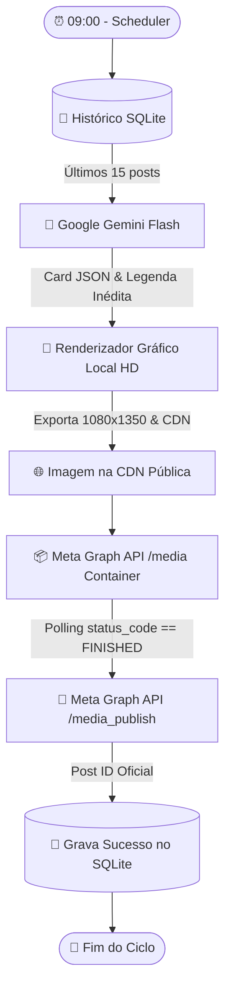

# 📸 Automação Diária para Instagram com IA

> Arquitetura e esteira completa 100% autônoma para geração e publicação diária no Feed do Instagram, agendada para as **09:00**, integrando **Google Gemini Flash**, **Gerador Gráfico Local HD (1080x1350)** e **Meta Instagram Graph API v21.0**.
>
> 📖 **Para o guia operacional completo com telas e passos detalhados, consulte o [Manual de Utilização](file:///c:/Users/guria/OneDrive/Documentos/instagram-daily-automation/MANUAL_DE_UTILIZACAO.md).**

---

## 🏗️ Arquitetura do Fluxo




---

## 🚀 Funcionalidades

- **Inteligência de Conteúdo sem Repetições**: Consulta os últimos 15 posts gravados no SQLite e injeta restrições negativas no prompt do Gemini, garantindo que o público receba sempre conteúdo fresco e inédito.
- **Formatação Estrita JSON**: Usa o `responseSchema` oficial da API do Gemini para eliminar erros de parsing.
- **Renderizador Gráfico Nativo (1080x1350 HD)**: Gera imagens verticais de alta qualidade profissional localmente com resvg (zero custos de API de renderização e sem limites de créditos).
- **Publicação Segura na Meta (v21.0)**: Cria o container de mídia, monitora ativamente o processamento até `status_code == 'FINISHED'` e publica no feed do Instagram.
- **Modo Dry-Run (Simulação Segura)**: Permite rodar e testar todo o pipeline localmente sem fazer postagens reais no feed.
- **Pronto para Docker**: Inclui `Dockerfile` e `docker-compose.yml` para rodar 24/7 em qualquer VPS ou servidor.

---

## 📂 Estrutura do Projeto

```
instagram-daily-automation/
├── .env.example              # Template com todas as chaves e variáveis
├── .gitignore                # Ignora .env, bancos de dados, node_modules e logs
├── package.json              # Scripts npm e dependências
├── Dockerfile                # Imagem Docker para deploy contínuo
├── docker-compose.yml        # Orquestração com volume persistente para SQLite
├── n8n_workflow.json         # Workflow pronto para importação no n8n
├── public/                   # Frontend SPA do Dashboard Web (Dark Glassmorphism)
│   ├── index.html            # Estrutura do painel de controle
│   ├── style.css             # Design system moderno e responsivo
│   └── app.js                # Lógica e interatividade cliente
├── src/
│   ├── config.js             # Validação e carregamento de configurações
│   ├── configManager.js      # Gerenciador de leitura/escrita atômica do .env
│   ├── server.js             # Servidor HTTP embutido e API REST
│   ├── database.js           # Gerenciador SQLite nativo (node:sqlite)
│   ├── services/
│   │   ├── gemini.js         # Integração Gemini Flash com anti-repetição
│   │   ├── localRenderer.js  # Gerador gráfico nativo HD (1080x1350)
│   │   └── metaInstagram.js  # Container e publicação na Meta Graph API v21.0
│   ├── pipeline.js           # Orquestrador da esteira com retries e logs
│   ├── scheduler.js          # Agendador cron diário (09:00 com fuso horário)
│   └── index.js              # Ponto de entrada CLI e Web Dashboard
├── python/                   # Implementação alternativa em Python
│   ├── requirements.txt
│   └── pipeline.py
├── tests/
│   └── pipeline.test.js      # Testes unitários do banco e anti-repetição
└── README.md
```

---

## 🔑 Obtenção das Credenciais de API

Copie o arquivo `.env.example` para `.env`:
```bash
cp .env.example .env
```

### 1. Google Gemini API (`GEMINI_API_KEY`)
1. Acesse o [Google AI Studio](https://aistudio.google.com/).
2. Clique em **Get API Key** e crie uma nova chave.
3. Cole no seu `.env` em `GEMINI_API_KEY`.

### 2. Meta Instagram Graph API (`META_IG_ACCOUNT_ID`, `META_ACCESS_TOKEN` e `INSTAGRAM_USERNAME`)
1. Certifique-se de que sua conta do Instagram é do tipo **Profissional (Empresarial ou Criador de Conteúdo)** e está vinculada a uma **Página do Facebook**.
2. Acesse o [Meta for Developers](https://developers.facebook.com/) e crie um App do tipo **Empresa / Outro**.
3. No **Graph API Explorer**:
   - Selecione o seu App.
   - Adicione as permissões: `instagram_basic`, `instagram_content_publish`, `pages_show_list`, `pages_read_engagement`.
   - Gere o token de usuário.
4. Para obter o `META_IG_ACCOUNT_ID`, execute a requisição:
   ```http
   GET /me/accounts?fields=instagram_business_account
   ```
   O campo `instagram_business_account.id` é o seu `META_IG_ACCOUNT_ID`.
5. Converta seu token temporário em um token de longa duração (60 dias) através do **Access Token Tool** da Meta ou do endpoint `oauth/access_token` com `grant_type=fb_exchange_token`.
6. Configure `INSTAGRAM_USERNAME=thebackenddrop` para exibir a marcação correta nos cards gerados e links rápidos no Dashboard.

---

## 🖥️ Dashboard Web Interativo (Novo!)

A esteira inclui um painel web moderno com design **Dark Glassmorphism**, rodando de forma leve e embutida no próprio processo Node.js.

### Como Iniciar o Painel Web:
```bash
npm run web
# ou simplesmente:
npm start
```
Acesse no seu navegador: **`http://localhost:3000`**

### Recursos Disponíveis no Painel Web:
- **📊 Visão Geral & Métricas:** Status do agendador em tempo real, próximo disparo, último post publicado com miniatura do card e botão de disparo imediato.
- **🎨 Laboratório de Criação (Live Preview):** Teste prompts, temas e sugestões rápidas, gerando a arte 1080x1350 na hora dentro de um mockup de smartphone antes de publicar no Instagram.
- **📁 Histórico & Galeria:** Grade visual com todos os posts gravados no SQLite, contendo imagem, pontos abordados, data e link direto para o post no Instagram.
- **🔑 Gestão de API Keys & Configurações:** Insira e atualize suas chaves do Google Gemini e Meta Graph API com máscara de segurança, teste a conexão da IA e configure o horário do disparo diário diretamente pela interface sem precisar editar arquivos de texto.

---

## 🧪 Comandos via Terminal (CLI)

### 1. Instalação das Dependências
```bash
npm install
```
*(No Windows PowerShell com restrição de script, utilize `npm.cmd install`)*

### 2. Executar os Testes Unitários
Valida a integridade completa em 9 blocos: persistência SQLite, renderização gráfica SVG/PNG nativa (1080x1350 HD), validação de configurações, IA estruturada com resiliência multi-modelo, mascaramento de credenciais, isolamento seguro do modo Dry-Run, conversor e reagendador dinâmico do cron e rotas da API HTTP do servidor web:
```bash
npm test
# ou diretamente via Node (caso o PowerShell restrinja scripts .ps1):
node tests/pipeline.test.js
```

### 3. Teste em Modo Simulação (Dry-Run)
Executa todo o ciclo imediatamente sem fazer publicações reais na Meta:
```bash
npm run run:dry
```
Você verá a criação da base de dados local em `data/history.db` e todo o fluxo executado em ~1 segundo!

### 4. Disparo Real Imediato via CLI
```bash
npm run run:once
```
Ou com um tema personalizado:
```bash
node src/index.js --run-once --theme "Design Patterns em TypeScript"
```

---

## ⏱️ Execução em Produção

### Opção A: Execução Contínua com Dashboard Web
Inicia o Dashboard Web na porta 3000 e o Agendador Diário simultaneamente:
```bash
npm start
```
Com gerenciador de processos PM2 (recomendado para VPS):
```bash
npm install -g pm2
pm2 start src/index.js --name "instagram-automation" -- --web
pm2 save
```

### Opção B: Docker / Docker Compose
Suba o serviço isolado em segundo plano com volume persistente para o SQLite e acesso ao Dashboard Web na porta 3000:
```bash
docker compose up -d
```
Acesse no navegador: **`http://localhost:3000`**

Para ver os logs em tempo real:
```bash
docker compose logs -f
```

### Opção C: Cron do Linux nativo
Se preferir usar o `cron` do Linux em vez do daemon Node:
```bash
crontab -e
```
Adicione a linha para disparar todo dia às 09:00:
```cron
0 9 * * * cd /caminho/para/instagram-daily-automation && /usr/bin/node src/index.js --run-once >> /caminho/para/instagram-daily-automation/logs/cron.log 2>&1
```

---

## 🔀 Alternativa no n8n (`n8n_workflow.json`)

Se você já utiliza ou prefere o **n8n**:
1. Abra seu painel do n8n.
2. Clique em **Workflows** > **Import from File...** e selecione o arquivo [n8n_workflow.json](file:///c:/Users/guria/OneDrive/Documentos/instagram-daily-automation/n8n_workflow.json).
3. Defina as variáveis de ambiente no arquivo `.env` do seu n8n (`GEMINI_API_KEY`, `META_IG_ACCOUNT_ID`, `META_ACCESS_TOKEN`) ou substitua diretamente nos nós de configuração.
4. O workflow conta com os nós de **Schedule Trigger (09:00)**, **Google Gemini**, **Meta Container**, **Wait Nodes** e **Meta Publish**.

---

## 🐍 Versão Alternativa em Python

Se o seu ambiente de produção for baseado em Python:
```bash
# 1. Instale as dependências
pip install -r python/requirements.txt

# 2. Teste simulado (Dry-Run)
python python/pipeline.py --run-once --dry-run

# 3. Disparo real imediato
python python/pipeline.py --run-once
```

---

## 🛡️ Tratamento de Erros e Resiliência

1. **Fallback Multi-Modelo no Gemini**: Caso o modelo principal sofra indisponibilidade ou picos de demanda temporários (HTTP 503 / 429 da Google), o sistema alterna automaticamente entre modelos compatíveis (`gemini-3.5-flash`, `gemini-3.8-flash`, `gemini-3.5-flash-lite`), com retries e backoff exponencial.
2. **Polling Ativo com Timeouts na Meta**:
   - Meta Graph API: aguarda até 100 segundos com verificações ativas a cada 5s até o `status_code` ser `FINISHED`, garantindo que a mídia seja codificada antes da publicação.
3. **Persistência Confiável**: Em caso de falha transitória, o erro é registrado no console com stack trace detalhado sem corromper a integridade do banco SQLite.
4. **Reagendamento Dinâmico em Memória**: Ao salvar novas configurações de horário ou fuso no Dashboard Web, a rotina cron é recalculada e reagendada dinamicamente sem necessidade de reiniciar o processo Node.js ou o container Docker.
5. **Dashboard Guard**: Autenticação opcional por senha com tokens de sessão assinados via HMAC e rate limiting contra ataques de força bruta para servidores expostos publicamente.
6. **Suíte Completa de 11 Blocos de Testes**: Validação automatizada cobrindo SQLite, motor gráfico SVG/PNG HD, resiliência do Gemini, segurança do modo Dry-Run, endpoints HTTP da API, módulo de autenticação e customização de nicho.

---

## 🤝 Como Contribuir

Contribuições da comunidade são muito bem-vindas! Consulte o arquivo [CONTRIBUTING.md](file:///c:/Users/guria/OneDrive/Documentos/instagram-daily-automation/CONTRIBUTING.md) para saber como configurar o ambiente local de desenvolvimento, rodar os testes unitários e enviar Pull Requests.

---

## 📄 Licença

Este projeto é distribuído sob a licença **MIT**. Consulte o arquivo [LICENSE](file:///c:/Users/guria/OneDrive/Documentos/instagram-daily-automation/LICENSE) para mais detalhes.
